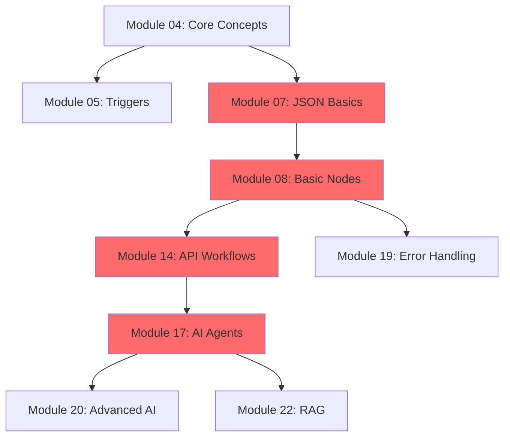

# N8N Masterclass - Learning Path

> 📚 A structured roadmap guiding you from intermediate to expert N8N practitioner

## Overview

This learning path breaks down the 17+ hour masterclass into 6 progressive phases, each building upon the previous one. Follow this sequence to maximize comprehension and skill development.

**Total Journey**: 31 modules | ~17 hours | 6 phases

---

## 🗺️ Recommended Study Sequence

### 🌱 Phase 1: Foundation
**Goal**: Master N8N fundamentals and environment setup  
**Duration**: ~2 hours  
**Complexity**: ⭐ Beginner-Intermediate  
**Workflows**: 0-2 basic demos

#### Modules

- [ ] **Module 01: Intro to Course** (2 min)
  - Set expectations and understand course structure
  - [📂 Notes](modules/01-foundation/01-intro-to-course/notes.md)

- [ ] **Module 02: Self Hosted vs Cloud** (37 min)
  - Choose and set up your N8N environment
  - Compare deployment options
  - [📂 Notes](modules/01-foundation/02-self-hosted-vs-cloud/notes.md)

- [ ] **Module 03: N8N Interface Tour** (36 min)
  - Navigate the N8N canvas confidently
  - Understand all UI components
  - [📂 Notes](modules/01-foundation/03-interface-tour/notes.md)

- [ ] **Module 04: Core Concepts** (23 min)
  - Grasp fundamental workflow concepts
  - Understand data flow and execution
  - [📂 Notes](modules/01-foundation/04-core-concepts/notes.md)

**Phase Completion Criteria**:
- ✅ N8N environment set up and running
- ✅ Comfortable navigating the interface
- ✅ Understand triggers, nodes, and data flow
- ✅ Built at least one test workflow

---

### 🔧 Phase 2: Fundamentals
**Goal**: Build solid automation foundations  
**Duration**: ~3 hours  
**Complexity**: ⭐⭐ Intermediate  
**Workflows**: 10-15 examples

#### Modules

- [ ] **Module 05: Common N8N Triggers** (21 min)
  - Master different trigger types
  - [📂 Notes](modules/02-fundamentals/05-common-triggers/notes.md)

- [ ] **Module 06: N8N AI Basics** (25 min)
  - Integrate AI into workflows
  - [📂 Notes](modules/02-fundamentals/06-ai-basics/notes.md)

- [ ] **Module 07: JSON Basics and Data Types** (14 min) ⚠️ **CRITICAL**
  - Foundation for all advanced work
  - [📂 Notes](modules/02-fundamentals/07-json-basics/notes.md)

- [ ] **Module 08: N8N Nodes (Basic)** (70 min) ⚠️ **LONGEST IN PHASE**
  - Master essential transformation nodes
  - [📂 Notes](modules/02-fundamentals/08-basic-nodes/notes.md)

- [ ] **Module 09: N8N Data Tables** (31 min)
  - Work with structured data efficiently
  - [📂 Notes](modules/02-fundamentals/09-data-tables/notes.md)

- [ ] **Module 10: N8N Binary Files** (26 min)
  - Handle files and attachments
  - [📂 Notes](modules/02-fundamentals/10-binary-files/notes.md)

**Phase Completion Criteria**:
- ✅ Comfortable reading and manipulating JSON
- ✅ Can use all essential nodes (Set, IF, Code, Split, Merge)
- ✅ Understand data tables and item structure
- ✅ Built multiple data transformation workflows

---

### 🔌 Phase 3: Integrations
**Goal**: Connect N8N to external services and APIs  
**Duration**: ~4 hours  
**Complexity**: ⭐⭐⭐ Intermediate-Advanced  
**Workflows**: 15-20 integration examples

#### Modules

- [ ] **Module 11: Google Credentials + Nodes** (59 min)
  - OAuth authentication mastery
  - Google Workspace automation
  - [📂 Notes](modules/03-integrations/11-google-credentials-nodes/notes.md)

- [ ] **Module 12: Properly Documenting Workflows** (12 min)
  - Professional workflow documentation
  - [📂 Notes](modules/03-integrations/12-workflow-documentation/notes.md)

- [ ] **Module 13: HTTP Request Node** (20 min)
  - Foundation for API work
  - [📂 Notes](modules/03-integrations/13-http-request-node/notes.md)

- [ ] **Module 14: N8N API Workflows** (91 min) ⚠️ **CRITICAL FOR API WORK**
  - Advanced pagination and error handling
  - Production-ready API patterns
  - [📂 Notes](modules/03-integrations/14-api-workflows/notes.md)

- [ ] **Module 15: Webhooks** (24 min)
  - Event-driven automation
  - [📂 Notes](modules/03-integrations/15-webhooks/notes.md)

- [ ] **Module 16: Web Scraping** (37 min)
  - Data extraction techniques
  - [📂 Notes](modules/03-integrations/16-web-scraping/notes.md)

**Phase Completion Criteria**:
- ✅ Set up OAuth credentials for major services
- ✅ Build pagination workflows handling 1000+ records
- ✅ Implement robust error handling
- ✅ Created webhook-triggered automations
- ✅ Built at least one web scraping pipeline

---

### 🤖 Phase 4: AI Workflows
**Goal**: Build production-ready AI automation systems  
**Duration**: ~5+ hours  
**Complexity**: ⭐⭐⭐⭐⭐ Expert  
**Workflows**: 10-15 complex AI systems

#### Modules

- [ ] **Module 17: Deeper AI Agents** (138 min) ⚠️ **LONGEST MODULE - CRITICAL**
  - Advanced agent architecture
  - Tool-calling and multi-agent systems
  - [📂 Notes](modules/04-ai-workflows/17-deeper-ai-agents/notes.md)

- [ ] **Module 18: Chathub** (40 min)
  - Conversational interfaces
  - [📂 Notes](modules/04-ai-workflows/18-chathub/notes.md)

- [ ] **Module 19: Error Handling & Debugging** (23 min)
  - Production-grade error management
  - [📂 Notes](modules/04-ai-workflows/19-error-handling-debugging/notes.md)

- [ ] **Module 20: Advanced AI Nodes** (82 min)
  - Specialized AI configurations
  - Cost optimization strategies
  - [📂 Notes](modules/04-ai-workflows/20-advanced-ai-nodes/notes.md)

- [ ] **Module 21: Image & Video AI** (17 min)
  - Multimodal AI integration
  - [📂 Notes](modules/04-ai-workflows/21-image-video-ai/notes.md)

- [ ] **Module 22: RAG Basics** (44 min)
  - Knowledge base AI systems
  - Vector databases and embeddings
  - [📂 Notes](modules/04-ai-workflows/22-rag-basics/notes.md)

**Phase Completion Criteria**:
- ✅ Built multi-step AI agent systems
- ✅ Implemented tool-calling functionality
- ✅ Created conversation management workflows
- ✅ Built a complete RAG pipeline
- ✅ Understand AI cost optimization

**💡 Recommendation**: This is the most intensive phase. Take breaks between modules and build multiple variations of each pattern.

---

### ⚡ Phase 5: Advanced Techniques
**Goal**: Optimize and scale workflows professionally  
**Duration**: ~2 hours  
**Complexity**: ⭐⭐⭐⭐ Advanced  
**Workflows**: 5-10 optimization patterns

#### Modules

- [ ] **Module 23: Advanced N8N** (30 min)
  - Sub-workflows and advanced patterns
  - [📂 Notes](modules/05-advanced-techniques/23-advanced-n8n/notes.md)

- [ ] **Module 24: Human in the Loop** (13 min)
  - Approval and review workflows
  - [📂 Notes](modules/05-advanced-techniques/24-human-in-loop/notes.md)

- [ ] **Module 25: Evaluations** (13 min)
  - Quality metrics and testing
  - [📂 Notes](modules/05-advanced-techniques/25-evaluations/notes.md)

- [ ] **Module 26: Building Workflows Faster** (29 min)
  - Productivity tips and shortcuts
  - [📂 Notes](modules/05-advanced-techniques/26-building-faster/notes.md)

**Phase Completion Criteria**:
- ✅ Implemented sub-workflow patterns
- ✅ Built human approval processes
- ✅ Created evaluation frameworks
- ✅ Mastered workflow builder productivity

---

### 🚀 Phase 6: Production & Deployment
**Goal**: Deploy workflows professionally and monetize skills  
**Duration**: ~2 hours  
**Complexity**: ⭐⭐⭐ Intermediate-Advanced  
**Workflows**: 5+ production demos

#### Modules

- [ ] **Module 27: Security & Compliance** (19 min)
  - Production security best practices
  - [📂 Notes](modules/06-production-deployment/27-security-compliance/notes.md)

- [ ] **Module 28: Model Context Protocol** (14 min)
  - MCP integration
  - [📂 Notes](modules/06-production-deployment/28-model-context-protocol/notes.md)

- [ ] **Module 29: Frontend UI** (13 min)
  - User-facing interfaces
  - [📂 Notes](modules/06-production-deployment/29-frontend-ui/notes.md)

- [ ] **Module 30: Upwork Freelancing** (29 min)
  - Monetization strategies
  - [📂 Notes](modules/06-production-deployment/30-upwork-freelancing/notes.md)

- [ ] **Module 31: More Projects** (Ongoing)
  - Portfolio building
  - [📂 Notes](modules/06-production-deployment/31-more-projects/notes.md)

**Phase Completion Criteria**:
- ✅ Documented security practices
- ✅ Built client-facing solutions
- ✅ Created portfolio pieces
- ✅ Ready to take on freelance clients

---

## 📊 Module Dependencies

**Legend**: 🔴 Red = Critical path modules

---

## 🎯 Study Recommendations

### Time Management

**Intensive Track** (2-3 weeks):
- Study 1 hour daily
- Complete 1-2 modules per day
- Build all workflows

**Balanced Track** (1-2 months):
- Study 3-4 hours weekly
- Complete 2-3 modules per week
- Focus on understanding over speed

**Casual Track** (3+ months):
- Study at your own pace
- 1 module per week
- Deep dive into each concept

### Study Best Practices

1. **Don't Skip Modules**: Each builds on previous knowledge
2. **Build Every Workflow**: Hands-on practice is essential
3. **Take Notes**: Use provided templates
4. **Experiment**: Modify workflows to test understanding
5. **Review Regularly**: Revisit earlier modules as you progress

### When to Take Breaks

- ✋ **After Module 08**: Consolidate fundamentals
- ✋ **After Module 14**: Process API integration patterns
- ✋ **After Module 17**: Most intensive module - take time to experiment
- ✋ **After Module 22**: Review all AI concepts before advancing

---

## 🔄 Iteration Strategy

As you progress, **revisit earlier workflows** and:
- Apply new techniques learned
- Optimize performance
- Add error handling
- Improve documentation

---

## 📈 Progress Tracking

Update your progress in [PROGRESS.md](PROGRESS.md) after each module:
- Module completion status
- Workflows built
- Key learnings
- Challenges faced

---

## 🎓 Next Steps After Completion

1. **Build Portfolio Projects** (Module 31)
2. **Contribute to N8N Community**
3. **Start Freelancing** (Module 30 guidance)
4. **Share Knowledge** - Blog, tutorials, workshops
5. **Keep Learning** - N8N updates, new integrations

---

**Ready to begin?** Start with [Module 01](modules/01-foundation/01-intro-to-course/notes.md)

